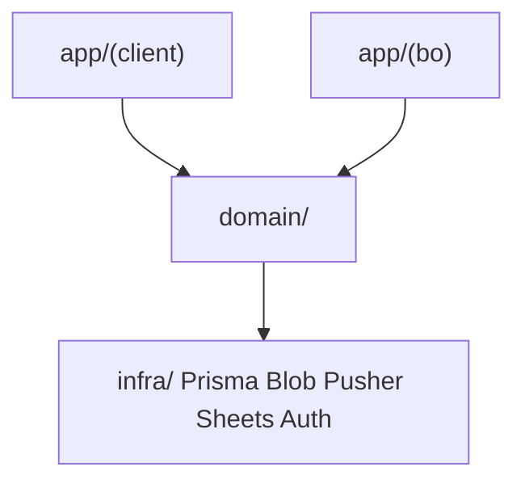
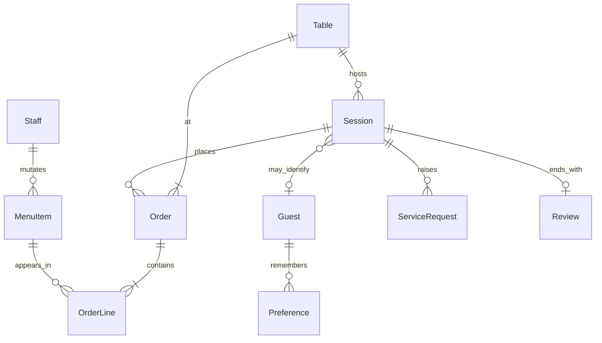
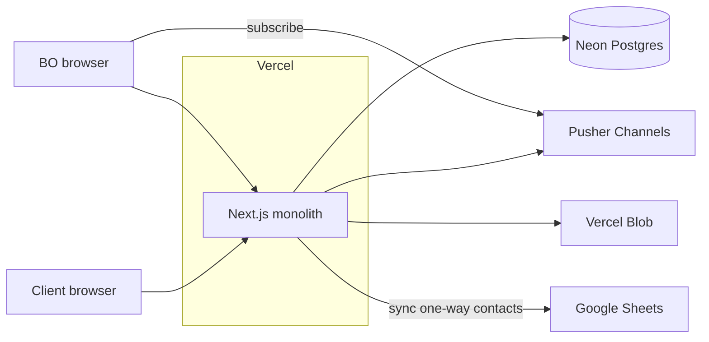

# Architecture Spine — Ma table (Résidence Moeris)

## Design Paradigm

**Monolithe modulaire** : un seul déployable Next.js (App Router) porte deux surfaces UI — **Client** (QR / séjour) et **Back-office** (salle) — et un **domain** partagé (menu, session, commande, avis, contact, service). Pas de microservices V1. Les couches : `app/(client)` · `app/(bo)` · `domain/` · `infra/`.

## Invariants & Rules

### AD-1 — Monolithe modulaire, deux surfaces

- **Binds:** all
- **Prevents:** backends séparés client/BO ; double vérité commande ; split microservices V1
- **Rule:** Un seul app Next.js déployée sur Vercel. Client et BO sont des route groups, pas des déploiements distincts. [ADOPTED]

### AD-2 — Direction des dépendances

- **Binds:** all modules
- **Prevents:** le client qui importe du code BO / mutateurs menu ; infra appelée depuis les composants UI sans passer par domain
- **Rule:** `app/(client)|app/(bo)` → `domain/` → `infra/`. `app/(client)` n’importe jamais `app/(bo)` ni des Server Actions réservées BO. [ADOPTED]



### AD-3 — Propriété d’écriture du catalogue Menu

- **Binds:** Menu, FR menu/BO
- **Prevents:** édition menu depuis le parcours client ; catalogue divergent client vs salle
- **Rule:** Seul le BO (staff authentifié) crée/met à jour plats, prix, dispo, photos. Le client lit le catalogue publié via domain en lecture seule. [ADOPTED]

### AD-4 — Mutations métier = Server Actions

- **Binds:** session, commande, avis, contact, service, menu, statuts
- **Prevents:** double surface REST + Actions pour les mêmes écritures
- **Rule:** Toute mutation métier V1 passe par Server Actions dans `domain/` (appelées depuis les surfaces). Route Handlers `/api` réservés à Auth.js et webhooks infra si besoin. [ADOPTED]

### AD-5 — Session séjour : cookie opaque, vérité Neon

- **Binds:** Session, UJ-1/2, reprise
- **Prevents:** payload métier (panier, avis) dans le cookie ; sessions non reprises après refresh ; confusion reprise-soirée vs mémoire 2ᵉ visite
- **Rule:** Cookie httpOnly porte un id opaque. L’entité `Session` (table, étape, panier) vit dans Neon. **Reprise R2** (même soirée) : restaurer l’étape + bannière soft « Tu en étais à… ». **Mémoire 2ᵉ visite** est distincte : cookie device et/ou ressaisie tél/email → `Guest` + prefs — ce n’est pas la reprise d’étape. TTL session ~soirée (≈6 h, PRD). [ADOPTED]

### AD-6 — Auth : staff credentials ; client anonyme

- **Binds:** Back-office, NFR sécurité
- **Prevents:** login client ; self-signup public staff ; OAuth obligatoire ; Auth.js Credentials + session DB incompatible
- **Rule:** Client jamais authentifié. BO via Auth.js (`next-auth@5.0.0-beta.32`) Credentials (email + mot de passe), `session.strategy: "jwt"` (Credentials n’autorise pas les sessions DB). Comptes **provisionnés** (pas d’inscription ouverte). Un rôle plat V1 « salle ». [ADOPTED]

### AD-7 — Fraîcheur BO = Pusher post-commit

- **Binds:** Commandes, Service, SM-4
- **Prevents:** WS self-host sur Vercel ; staff qui rate une commande ; payloads Pusher inventés par surface
- **Rule:** Après commit Neon d’une `Order` ou `ServiceRequest`, publier sur Pusher canal `bo-floor` un événement typé `{ kind: "order"|"service", id, tableId, status, at }`. Le BO s’abonne et refetch domain si besoin. Poll soft = filet uniquement. [ADOPTED]

### AD-8 — Contacts : Neon vérité, Sheet miroir

- **Binds:** Contact opt-in, Mémoire, UJ-2
- **Prevents:** Sheet comme lookup runtime ; dual-write concurrent ; reconnaissance cassée
- **Rule:** Opt-in écrit d’abord en Neon (`Guest` contact en clair, accès staff-only). Sync one-way async Neon → Google Sheet (best-effort ; échec loggé, UX client non bloquée). Reconnaissance / prefs = Neon only. [ADOPTED]

### AD-9 — QR Ma table = table stable + une session active

- **Binds:** Entrée table, Commande, Carte imprimée
- **Prevents:** choix de table in-app V1 ; plusieurs sessions actives concurrentes par table ; QR session-only
- **Rule:** L’URL QR encode un `tableId` stable. Au scan : reprendre la `Session` active de cette table si TTL non expiré, sinon en créer une. **Au plus une Session `active` par table** dans le TTL (~6 h). Toute `Order` porte `tableId` + `sessionId`. QR Wi‑Fi hors produit. [ADOPTED]

### AD-10 — Médias plats = Vercel Blob

- **Binds:** Menu photos
- **Prevents:** Cloudinary/S3 parallèle V1 ; upload anonyme
- **Rule:** Upload Blob uniquement depuis BO authentifié. Métadonnées/URL en Neon sur le plat. Client rend via `next/image`. [ADOPTED]

### AD-11 — Environnement data unique V1

- **Binds:** deploy, preview, ops
- **Prevents:** fausse isolation preview/prod
- **Rule:** Vercel production et preview partagent le même Neon (`DATABASE_URL` pooled + `DIRECT_URL` migrations). Prisma en runtime Node avec `@prisma/adapter-neon` si driver serverless. Pas de `migrate reset` automatisé. Revisit : Neon séparée si tests écrasent le réel. [ADOPTED]

### AD-12 — Commande : création et statuts

- **Binds:** Commande, BO, UJ-3
- **Prevents:** drafts Order ; INSERT commande depuis BO ; statuts inventés ; transitions client
- **Rule:** Seule l’action client `placeOrder` **INSERT** une `Order` (statut initial obligatoire `received`) à partir du panier session. Transitions `received` → `preparing` → `served` **BO only**. Gate UX « commande reçue » = statut ≥ `received`. [ADOPTED]

### AD-13 — Gate « Terminer mon expérience »

- **Binds:** FR-12, fin d’expérience, UJ-1
- **Prevents:** avis/contact avant qu’une commande soit engagée
- **Rule:** L’action Terminer (et donc avis → merci chef → contact) n’est disponible que si la session a au moins une `Order` en statut `received` ou au-delà. [ADOPTED]

### AD-14 — Service = catalogue fermé + cycle court

- **Binds:** Service, UX V1
- **Prevents:** chat / free-text ; types inventés ; statuts service divergents
- **Rule:** `ServiceRequest.type` ∈ `{ waiter, water, bill, other }` **sans champ note libre**. Statuts : `open` → `done` (transition BO only). Un écran client, pas de fil. Publish Pusher (AD-7). [ADOPTED]

### AD-15 — Contact opt-in XOR + privacy min

- **Binds:** FR contact, privacy PRD §11, UJ-1
- **Prevents:** tél+email obligatoires ; tracking intrusif ; Sheet comme source d’identité
- **Rule:** Opt-in = **téléphone XOR email** (un seul canal). Pas de tracking table/heure/compagnie en V1. Finalité stockée = soirées Moeris / relation Résidence. Clair en Neon staff-only + miroir Sheet (AD-8). [ADOPTED]

### AD-16 — Fraîcheur menu client + goûts sur commande

- **Binds:** FR-7, Commande goûts, Menu
- **Prevents:** client sur catalogue périmé après edit BO ; goûts perdus / réinterprétés
- **Rule:** Après mutation menu BO, le client voit le catalogue à jour en moins d’1 min (revalidate/tag cache Next — pas de cache menu « immortal »). Les goûts cuisine sont **snapshotés** sur l’`Order` à l’envoi (immuables ensuite pour la salle). [ADOPTED]

### AD-17 — Surfaces UX structurelles

- **Binds:** plateforme, BO shell, multi-support
- **Prevents:** app mobile-only ; BO multi-apps ; hub client type dashboard
- **Rule:** Client et BO sont **responsive** (phone / tablette / desktop) ; entry principale = QR. BO = **un shell** à trois zones Menu | Commandes | Service (pas de vue cuisine séparée V1). [ADOPTED]

### AD-18 — Panier sur Session uniquement

- **Binds:** Commande, Session
- **Prevents:** Order draft parallèle ; deux shapes panier
- **Rule:** Le panier (lignes + goûts en cours) vit sur `Session` (JSON ou tables filles non-Order). Aucune ligne `Order` / `OrderLine` avant `placeOrder` (AD-12). [ADOPTED]

### AD-19 — Guest = upsert unique domain

- **Binds:** Contact, Mémoire, UJ-2
- **Prevents:** deux owners créant des Guest distincts pour le même contact
- **Rule:** Toute création/liaison `Guest` (opt-in, soft device, ressaisie) passe par `domain/guest` upsert clé normalisée (tél E.164 ou email lower). Pas d’INSERT Guest ad hoc depuis review/contact/session. [ADOPTED]

### AD-20 — Mémoire préférés bornée

- **Binds:** Mémoire, FR-18/19, UJ-2
- **Prevents:** listes préférés illimitées / journaux de tracking déguisés
- **Rule:** Préférés exposés = top **3 à 5** `Preference` / Guest. Pas de journal table×heure. Réapply goûts = 1 action domain qui préremplit le panier session, sans muter d’Order passées. [ADOPTED]

## Consistency Conventions

| Concern | Convention |
| --- | --- |
| Naming | Identifiants / fichiers / enums code en **EN** ; copy UI en **FR** |
| IDs | UUID (ou cuid) en base ; `tableId` stable exposé dans l’URL QR |
| Dates | ISO-8601 UTC en base ; affichage localisé FR à la UI |
| Erreurs Server Actions | Shape `{ ok: false, code, message }` ; pas d’exceptions nues vers l’UI |
| Auth cookies | Préfixe distinct session séjour client vs session Auth.js staff |
| Logging | Pas de PII contact en clair dans les logs appli ; ids `guestId` / `sessionId` |
| Perf / a11y | Premier écran utile sous ~3 s en 4G moyenne (cible PRD) ; gros touch targets + contraste (UX Citrus) — pas de score WCAG formel V1 |
| Config | Secrets uniquement via env Vercel (Neon, Auth, Pusher, Blob, Google Sheets) |
| Prisma runtime | Node.js (pas Edge) sauf adoption explicite adapter Neon |

## Stack

| Name | Version |
| --- | --- |
| Next.js (create-next-app, App Router) | 16.2.11 |
| React (via Next) | 19.x (bundle Next 16) |
| TypeScript | 5.x (default create-next-app ; pas forcer TS 7) |
| Tailwind CSS | 4.x (default create-next-app) |
| PostgreSQL (Neon) | Neon current serverless Postgres |
| Prisma / `@prisma/client` | 7.9.0 |
| `@prisma/adapter-neon` | 7.9.0 |
| `@neondatabase/serverless` | 1.1.0 |
| Auth.js (`next-auth@beta`) | 5.0.0-beta.32 |
| Vercel Blob (`@vercel/blob`) | 2.6.1 |
| Pusher server (`pusher`) | 5.3.4 |
| Pusher client (`pusher-js`) | 8.6.0 |
| Google Sheets API (sync contacts) | v4 |
| Hosting | Vercel |

## Structural Seed

```text
ma-table/
  app/
    (client)/          # parcours QR : accueil, menu, commande, service, fin
    (bo)/              # menu admin, commandes, file service — derrière Auth
    api/auth/[...]/auth]/ # Auth.js handlers only
  domain/              # use-cases + Server Actions métier
  infra/               # prisma, blob, pusher, sheets, auth config
  prisma/
    schema.prisma
```





## Capability → Architecture Map

| Capability / Area | Lives in | Governed by |
| --- | --- | --- |
| Entrée QR / Table | `(client)` + `Table`/`Session` | AD-9, AD-5 |
| Session & reprise / panier | `domain/session` + Neon | AD-5, AD-18 |
| Menu lecture client | `(client)` + `domain/menu` read | AD-3, AD-16 |
| Menu écriture BO | `(bo)` + `domain/menu` write | AD-3, AD-6, AD-10, AD-16 |
| Commande + goûts | `domain/order` + Pusher | AD-4, AD-7, AD-12, AD-16, AD-18 |
| Service micro-missions | `domain/service` + Pusher | AD-4, AD-7, AD-14 |
| Avis + merci chef + Terminer | `domain/review` | AD-4, AD-13 |
| Contact opt-in | `domain/contact` + Sheet sync | AD-8, AD-15, AD-19 |
| Mémoire / reconnaissance | `domain/guest` | AD-5, AD-8, AD-15, AD-19, AD-20 |
| Auth BO | Auth.js + `(bo)` layout | AD-6, AD-17 |
| Deploy / env | Vercel + Neon unique | AD-11 |
| Responsive multi-support | `(client)` + `(bo)` | AD-17 |

## Deferred

| Item | Why it can wait |
| --- | --- |
| Neon preview isolée | Un seul Neon accepté V1 ; revisit si pollution test/prod |
| Ably / QoS realtime | Pusher suffit 1 site ; upgrade si volume/fiabilité |
| Browser Push API staff | Canal in-app d’abord |
| Rôles BO fins (cuisine vs salle) | Rôle plat V1 ; vue cuisine hors lancement UX |
| Hash/chiffrement contact avancé | Clair staff-only V1 ; conformité conseil = process hors spine |
| Multi-sites | Hors scope PRD |
| Paiement digital | Non prévu |
| PWA installable / lien magique | PRD non-requis V1 |
| ORM/auth pins patch exact | Stack déjà pinée 2026-07-24 ; bump contrôlé en stories |
| SLA 99.99 / observabilité avancée | Objectif « tient un service » ; tooling ops plus tard |
| Cible chiffrée perf sous 3s / a11y WCAG formelle | NFR pragmatique PRD ; budgets exacts en stories |
| 3 tons « merci chef » / copy chaleur | UX/copy (EXPERIENCE), pas invariant d’infra |
| Droits suppression contact process | PRD : manuel V1 documenté ; hors spine runtime |
| Algorithme scoring exact des préférés | Plafond 3–5 fixé (AD-20) ; formule ranking en epics |
